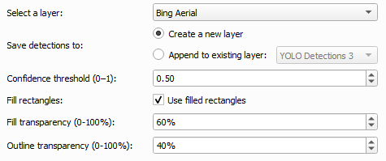
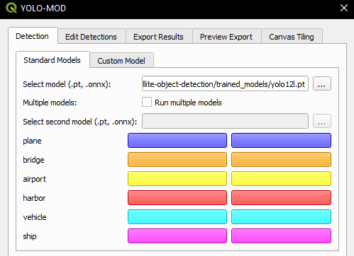
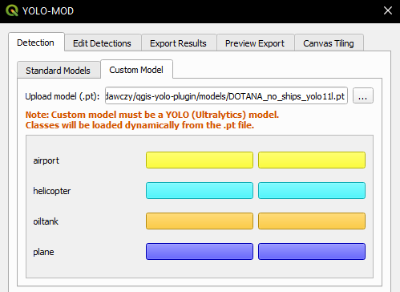
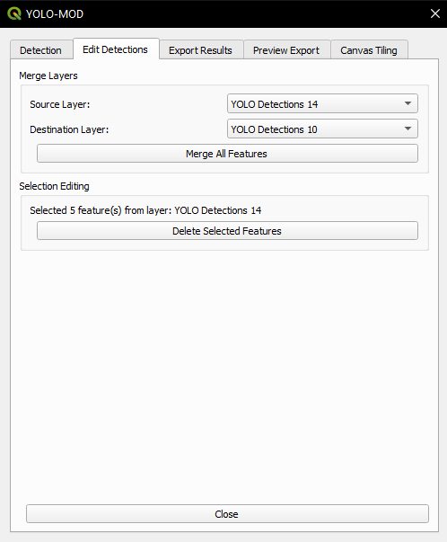

# YOLO-MOD Plugin

## Highlights

- Integration of deep learning-based object detection into QGIS workflows
- Support for multi-class detection (planes, bridges, airports, harbors, vehicles, ships)
- Compatibility with PyTorch (.pt) and ONNX (.onnx) models
- Support for YOLOv12, D-FINE, and RF-DETR architectures

## Description

YOLO-MOD is a QGIS plugin for object detection and classification in optical remote sensing imagery using deep learning models. It allows users to detect multiple object categories—such as planes, bridges, airports, harbors, vehicles, and ships—directly within standard GIS workflows. The plugin provides access to pre-trained models and tools for exporting detection results and generating datasets, without requiring prior machine learning experience.

The latest version supports **YOLOv12, D-FINE, and RF-DETR** architectures with multiple model sizes.

## Datasets and Models

### Model Download

All trained models used in this project are publicly available via the Mega platform:

👉 https://mega.nz/folder/yyQ1SaIB#XTx5YLbTNea4Cb0QNVHhbQ

The repository provides:

- PyTorch (`.pt`) models  
- ONNX (`.onnx`) models  
- Metadata files describing model architecture, training dataset, input resolution, and performance metrics  

### How to use models

1. Download the models from Mega platform
2. Select the desired model (`.pt` or `.onnx`)  
3. Load it in the YOLO-MOD plugin  

### Dataset

The **[dataset](https://mega.nz/file/TvxlVKZY#EYTy0WMJ7E_iaAh_DIGqXh2VgQLWutUm2iUjO5wdiaI)** contains optical remote sensing imagery with six object categories:

- **Plane**
- **Bridge**
- **Airport**
- **Harbor**
- **Vehicle**
- **Ship**

Dataset characteristics:
- **Image resolution:** 800 × 800 pixels
- **Image type:** Optical remote sensing imagery

The dataset was created by combining two existing remote sensing datasets:
- DIOR
- DOTA v2

## Hardware Environments

Models were trained and evaluated on two workstation configurations differing in GPU hardware:

- **Workstation 1:** NVIDIA RTX 6000 Ada Generation (48 GB VRAM)
- **Workstation 2:** NVIDIA RTX 6000 Blackwell (96 GB VRAM)

## Results

Performance was evaluated on the test split using standard COCO mAP metrics.

### Workstation 1

| Architecture | Variant | mAP50 | mAP50-95 |
|:---|:---:|:---:|:---:|
| **YOLOv12** | M | 0.886 | 0.650 |
| **YOLOv12** | L | 0.889 | 0.655 |
| **YOLOv12** | XL | 0.892 | 0.664 |
| **RF-DETR** | L | 0.820 | 0.596 |
| **RF-DETR** | XL | 0.806 | 0.577 |
| **RF-DETR** | 2XL | 0.815 | 0.598 |
| **D-FINE** | M | 0.795 | 0.583 |
| **D-FINE** | L | 0.783 | 0.574 |
| **D-FINE** | XL | 0.783 | 0.575 |

### Workstation 2

| Architecture | Variant | mAP50 | mAP50-95 |
|:---|:---:|:---:|:---:|
| **YOLOv12** | M | 0.896 | 0.626 |
| **YOLOv12** | L | 0.897 | 0.639 |
| **YOLOv12** | XL | **0.899** | **0.635** |
| **RF-DETR** | L | 0.806 | 0.576 |
| **RF-DETR** | XL | 0.816 | 0.591 |
| **RF-DETR** | 2XL | 0.826 | 0.607 |
| **D-FINE** | M | 0.792 | 0.587 |
| **D-FINE** | L | 0.788 | 0.581 |
| **D-FINE** | XL | 0.793 | 0.590 |

## ⚙️ Python Dependencies

⚠️ These dependencies are not installed automatically by QGIS.

In addition to the plugin installation, several Python dependencies must also be installed in the QGIS Python environment:

- ultralytics
- onnx
- onnxruntime / onnxruntime-gpu

Detailed installation instructions and tested dependency versions are provided below. Future versions of the plugin are planned to be distributed through the official QGIS Plugin Repository.

## Plugin Installation

1. Download the plugin ZIP: **[yolo_mod.zip](https://mega.nz/file/LyRmEKaK#51K4l8OhGZNNedGzsRaicwIYZL6tKateRr1F040LTnI)**

2. Run **QGIS**.

3. Open: **Plugins → Manage and Install Plugins**

4. Select: **Install from ZIP**

5. Choose the downloaded ZIP file.

6. Click **Install Plugin**.

## Requirements

### QGIS Environment
The plugin was developed and tested on Windows 11 using QGIS installed via **OSGeo4W (versions 3.40.6-Bratislava and 3.42.2-Münster)**. Other installation methods and operating systems are not supported.

## Hardware Requirements

GPU acceleration is strongly recommended for practical use.

- **Recommended:** NVIDIA GPU with CUDA support (CUDA 11.x or 12.x, depending on PyTorch/ONNX Runtime build)
- **CPU-only mode:** supported, but significantly slower and not suitable for large images or real-world workflows

The plugin supports both PyTorch and ONNX Runtime inference backends:
- PyTorch requires CUDA-enabled installation for GPU acceleration
- ONNX Runtime can run in CPU or GPU mode depending on the installed package (onnxruntime / onnxruntime-gpu)

### Python Dependency
The plugin depends on the `ultralytics` Python library.

### Install Dependency (Windows / OSGeo4W)

1. Open **OSGeo4W Shell** matching your QGIS installation.
2. Run:
   ```bash
      # CPU version
      pip install ultralytics onnx onnxruntime

      # GPU version (recommended)
      pip install ultralytics onnx onnxruntime-gpu
   ```

### Recommended dependency versions (tested)

Due to potential compatibility issues with the QGIS embedded Python environment (OSGeo4W), it is recommended to install the following tested versions of the dependencies:

```bash
pip install ultralytics==8.3.0
pip install onnx==1.16.1
pip install onnxruntime-gpu==1.18.0
pip install numpy==1.26.4  # optional; ensure compatibility with QGIS Python environment
 ```
These versions were tested with QGIS 3.40.6 (Bratislava) and 3.42.2 (Münster) using the OSGeo4W distribution (Python 3.11).

## YOLO-MOD Plugin GUI

### Detection

The Detection tab contains the main object detection workflow and is divided into two subtabs: **Standard Models** and **Custom Model**.

The following options are available regardless of the selected subtab:

1. Select a layer - image from this layer will be processed.
2. Save detections to - specifies whether detections are saved to a new layer or appended to an existing layer (e.g. "YOLO Detections 1").
3. Confidence threshold - detections below the selected confidence threshold are discarded.
4. Fill rectangles - enables drawing filled bounding boxes.
5. Fill transparency - sets the transparency level for filled rectangles.
6. Outline transparency - sets the transparency level for bounding box outlines.



### Standard Models

The Standard Models subtab provides access to the pre-trained models distributed with the project.

Additional options include:

1. Select model - choose one of the provided PyTorch (`.pt`) or ONNX (`.onnx`) models.
2. Multiple models - enables inference using two models simultaneously.
3. Select second model - choose the second model used during detection.
4. Class names and colors - displays all supported object classes together with their assigned display colors.



### Custom Model

The Custom Model subtab allows users to perform inference using their own trained Ultralytics YOLO model.

Additional options include:

1. Upload model - load a custom PyTorch (`.pt`) Ultralytics YOLO model.
2. Dynamically loaded classes - class names are automatically read from the selected model and displayed in the interface. Each class is assigned a random display color, allowing custom models to be used without additional configuration.



### Edit Detections

The previous **Merge Layers** tab has been expanded and renamed to **Edit Detections**.

The tab provides tools for editing detection layers, including:

- merging detection features from one layer into another,
- deleting selected detection features.

Features to be removed are selected using the standard QGIS selection tools, such as **Select Features by Area** or **Select Features by Single Click**.



### Export Results

The YOLO-MOD plugin provides an export interface for layer data, including:

- map extent export to PNG,
- detection export in YOLO format,
- output directory selection,
- source layer selection.


### Preview Export

Preview exported detections using a raster image (`.png`) together with the corresponding YOLO annotation file (`.txt`).


### Canvas Tiling

The Canvas Tiling tool automatically splits the current QGIS map extent into image tiles.

The user can configure:

- tile width,
- tile height,
- tile overlap percentage,
- output directory,
- color of padding.

Instead of starting immediately, the **Preview & Start Tiling** button first displays a preview of the generated tile grid. The user can then confirm the operation to generate the tiles or cancel it before any files are written.


## Illustrative examples
This example demonstrates expected output for planes recognition using default parameters and Large YOLOv8 model:


## Known Issues

### Invalid Data Source / Unexpected QGIS Launch

On some systems, running the plugin may trigger errors like:

- `Invalid Data Source: C:\Users\{username}\--json is not a valid or recognized data source.`
- `Invalid Data Source: C:\Users\{username}\AppData\Roaming\Python\Python312\site-packages\cpuinfo\cpuinfo.py is not a valid or recognized data source.`

Additionally, a second QGIS instance might launch unexpectedly. This issue is related to the `cpuinfo` library used internally by `ultralytics`, particularly when calling `get_cpu_info()`.  

#### Temporary Workaround

You can patch the issue by modifying the `ultralytics/engine/predictor.py` file. Locate the `setup_model` function and change the `device` assignment line:

```python
def setup_model(self, model, verbose=True):
    self.model = AutoBackend(
        weights=model or self.args.model,
        device=torch.device("cpu"),  # <---
        dnn=self.args.dnn,
        data=self.args.data,
        fp16=self.args.half,
        batch=self.args.batch,
        fuse=True,
        verbose=verbose,
    )
```

This forces the model to run on CPU, avoiding the call to get_cpu_info() that triggers the issue.

For more context, see the related [Ultralytics GitHub issue #8609](https://github.com/ultralytics/ultralytics/issues/8609).

### Slower first inference when using ONNX models

The first ONNX inference usually has a higher initialization cost due to session setup.  
Subsequent inferences are significantly faster, as the model and required resources are already loaded in memory.  
In PyTorch (.pt), this initial overhead is often smaller.
