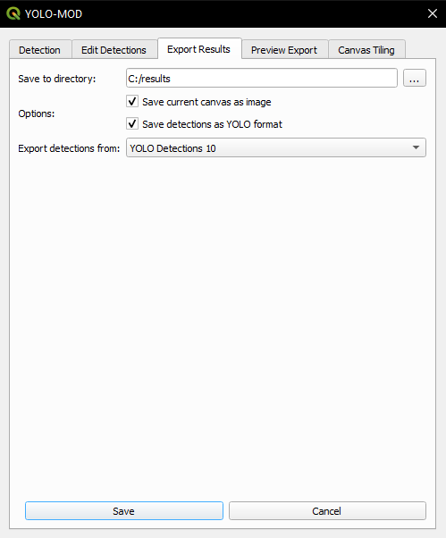
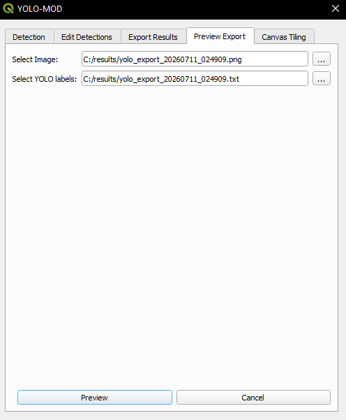
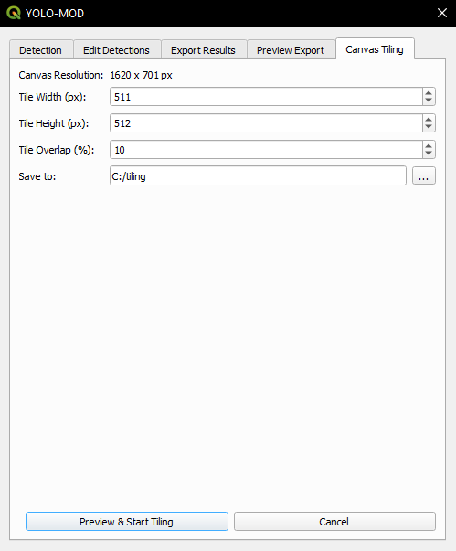

# YOLO-MOD Plugin

[](https://doi.org/10.1016/j.softx.2026.102721)
[](https://doi.org/10.5281/zenodo.19534383)

⚠️ Trained models are not included in this repository and must be downloaded from Zenodo (see the section below).
---

## Highlights

- Integration of YOLO-based object detection into QGIS workflows
- Support for multi-class detection (ships, aircraft, helicopters, airports, storage tanks)
- Compatibility with PyTorch (.pt) and ONNX (.onnx) models
- Cross-dataset benchmarking on FAIR1M
- Evaluation on large-swath imagery (4096 × 4096 pixels)

---

## Current release

Version: **v2.0.0**

Latest plugin package:  
yolo_mod.zip

Tested environment:

- QGIS 3.40 (Bratislava)
- QGIS 3.42 (Münster)
- Windows 11
- OSGeo4W distribution
  
Future releases and updates will be published through the GitHub repository.

---

## Description

YOLO-MOD is a QGIS plugin for object detection and classification in optical remote sensing imagery using **YOLO deep learning models**. It allows users to detect multiple object categories—such as ships, aircraft, helicopters, airports, and storage tanks—directly within standard GIS workflows. The plugin provides access to pre-trained models and tools for exporting detection results and generating datasets, without requiring prior machine learning experience. The latest version supports **YOLOv11 and YOLOv12** architectures with multiple model sizes.

---

## Datasets and Models

The YOLO-MOD plugin does not include trained models in the plugin package in order to keep it lightweight.

### Model Download

All trained models used in this project are publicly available via the Zenodo platform:

👉 https://zenodo.org/records/19534383  
👉 https://doi.org/10.5281/zenodo.19534383  

The repository provides:

- PyTorch (`.pt`) models  
- ONNX (`.onnx`) models  
- metadata files describing model architecture, training dataset, input resolution, and performance metrics  

This ensures long-term accessibility and reproducibility of the results presented in the associated *SoftwareX* publication.

---

### How to use models

1. Download the archive from Zenodo  
2. Extract `yolo-mod-models.zip`  
3. Select the desired model (`.pt` or `.onnx`)  
4. Load it in the YOLO-MOD plugin  

---

### Datasets

1. **[DOTANA](https://drive.google.com/file/d/1s0u--CU-VVmv0t_O9_3TNNA2VcLahLPu/)** – storage tanks, airports, helicopters, aircraft
   - image resolution: 640 × 640 pixels 
3. **[ShipRSImageNet](https://github.com/zzndream/ShipRSImageNet?tab=readme-ov-file#dataset-download)** – warships and civilian ships
   - image resolution: 930 × 930 pixels

These datasets consist of relatively small image patches compared to the high-resolution imagery used in cross-dataset benchmarking (FAIR1M), which contains images ranging from 2000 to 7000 pixels.

---

## Model Summary

| Dataset           | Model Size  | YOLO version | mAP50-95 | mAP50  |
|------------------|------------|--------------|----------|--------|
| DOTANA (no ships)| Extra Large| 12           | 0.6039   | 0.9591 |
| DOTANA (no ships)| Extra Large| 11           | 0.6030   | 0.9581 |
| ShipRSImageNet   | Large      | 11           | 0.7548   | 0.9025 |
| ShipRSImageNet   | Small      | 11           | 0.7543   | 0.9065 |

These results correspond to evaluation on in-domain test datasets and serve as a reference for comparison with cross-dataset benchmarking results. While the models achieve strong performance on benchmark datasets, their robustness in real-world scenarios remains an open question.

---

**DOTANA (no ships) predictions:**


**ShipRSImageNet predictions:**


These examples show detection results on benchmark datasets using test set images. While the models achieve strong performance on benchmark datasets, their robustness in real-world scenarios remains an open question. To address this, we performed additional cross-dataset and large-scale evaluations.

---

## Cross-dataset Benchmarking (FAIR1M)

To assess the generalization capability of the proposed models beyond the training domain, additional experiments were conducted using a subset of the FAIR1M dataset [1], which was not used during model training or prior evaluation.

### Experimental setup

- Dataset: FAIR1M (selected maritime scenes)
- Number of images: 70
- Image resolution: 2000–7000 pixels (variable)
- Scene types: port areas, coastal infrastructure, and ship-dense regions
- Annotation format: OBB converted to HBB
- Training dataset: ShipRSImageNet

**Models:**
- YOLOv11 Large (`ships_yolo11l`)
- YOLOv8 Large  

The YOLOv8 Large model serves as a baseline and was trained using the publicly available Ultralytics implementation.

- Training duration: 100 epochs (identical for both models)
- Soft-NMS: not used

---

### Results

| Model          | mAP50  | mAP50-95 |
|----------------|--------|----------|
| YOLOv11 Large  | 0.0956 | 0.0531   |
| YOLOv8 Large   | 0.0797 | 0.0471   |

These results indicate a substantial degradation in performance compared to in-domain evaluation (mAP50 ≈ 0.90). This represents an order-of-magnitude drop in detection performance, highlighting the difficulty of generalizing to unseen large-scale remote sensing imagery.

---

### Reference (in-domain performance)

| Model          | mAP50  | mAP50-95 |
|----------------|--------|----------|
| YOLOv11 Large  | 0.9025 | 0.7548   |

---

### Key observations

- A substantial performance drop is observed on FAIR1M (mAP50 < 0.10)
- In-domain performance remains high (mAP50 ≈ 0.90)
- This demonstrates a significant generalization gap
- YOLOv11 slightly outperforms YOLOv8, but both models show limited robustness
- The degradation is not caused by insufficient training (100 epochs)

---

### Discussion

The performance gap highlights limitations of models trained on curated datasets when applied to real-world imagery:

- significant resolution mismatch (training: ≤ 930 pixels vs evaluation: up to 7000 pixels)
- scene complexity
- object density
- domain shift
- tiling-based inference may introduce boundary artifacts and context fragmentation

These findings are consistent with qualitative evaluation results presented in the paper.

---

## Large-scale evaluation (4096 × 4096)

Additional experiments were conducted on large-swath imagery (4096 × 4096 pixels) extracted from QGIS basemap services.

These reveal:

- missed detections    
- false positives  

These effects are illustrated in Figure 7 of the paper.

---

## Reproducibility

All models, configuration files, and example scripts are available in this repository.

The FAIR1M dataset is publicly available. The modified subset is not redistributed due to licensing constraints, but experiments can be reproduced using the described setup.

---

**Comparison of detection results on FAIR1M maritime scene (cropped region)**

Left: YOLOv8 Large  
Right: YOLOv11 Large  


YOLOv11 detects a larger number of vessels, particularly in clustered regions, while YOLOv8 fails to identify several objects. However, YOLOv11 also introduces additional duplicate detections. Both models exhibit missed detections, especially for small and densely packed vessels. This example illustrates the trade-off between recall and precision, and highlights the limited generalization capability of models trained on ShipRSImageNet when applied to unseen high-resolution imagery.

---
## Installation Overview

The YOLO-MOD plugin is currently distributed as a ZIP package and can be installed in QGIS using the Install from ZIP option.

## ⚙️ Python Dependencies

⚠️ These dependencies are not installed automatically by QGIS.

In addition to the plugin installation, several Python dependencies must also be installed in the QGIS Python environment:

- ultralytics
- onnx
- onnxruntime / onnxruntime-gpu

Detailed installation instructions and tested dependency versions are provided below. Future versions of the plugin are planned to be distributed through the official QGIS Plugin Repository.

## Plugin Installation

1. Download the plugin ZIP: **[yolo_mod.zip](https://mega.nz/file/yQFT0QYA#HrRuEY-1COQu8B7XO7vM0LpPJJ2j7NvHBBbNesMSawo)**

2. Run **QGIS**.

3. Open: **Plugins → Manage and Install Plugins**

4. Select: **Install from ZIP**

5. Choose the downloaded ZIP file.

6. Click **Install Plugin**.

## Requirements

### QGIS Environment
The plugin was developed and tested on Windows 11 using QGIS installed via **OSGeo4W (versions 3.40.6-Bratislava and 3.42.2-Münster)**. Other installation methods and operating systems are not supported.

## Hardware Requirements

GPU acceleration is strongly recommended for practical use.

- **Recommended:** NVIDIA GPU with CUDA support (CUDA 11.x or 12.x, depending on PyTorch/ONNX Runtime build)
- **CPU-only mode:** supported, but significantly slower and not suitable for large images or real-world workflows

The plugin supports both PyTorch and ONNX Runtime inference backends:
- PyTorch requires CUDA-enabled installation for GPU acceleration
- ONNX Runtime can run in CPU or GPU mode depending on the installed package (onnxruntime / onnxruntime-gpu)

### Python Dependency
The plugin depends on the `ultralytics` Python library.

### Install Dependency (Windows / OSGeo4W)

1. Open **OSGeo4W Shell** matching your QGIS installation.
2. Run:
   ```bash
      # CPU version
      pip install ultralytics onnx onnxruntime

      # GPU version (recommended)
      pip install ultralytics onnx onnxruntime-gpu
   ```

### Recommended dependency versions (tested)

Due to potential compatibility issues with the QGIS embedded Python environment (OSGeo4W), it is recommended to install the following tested versions of the dependencies:

```bash
pip install ultralytics==8.3.0
pip install onnx==1.16.1
pip install onnxruntime-gpu==1.18.0
pip install numpy==1.26.4  # optional; ensure compatibility with QGIS Python environment
 ```
These versions were tested with QGIS 3.40.6 (Bratislava) and 3.42.2 (Münster) using the OSGeo4W distribution (Python 3.11).

## YOLO-MOD Plugin GUI
The plugin is configured to let the user define the input parameters:
1. Select a layer - image from this layer will be processed.
2. Select model - selected model will be used for objects recognition.
3. Multiple layers - possibilty to enable two models.
4. Select second model - second model used for object detection.
5. Save detections to - specifies whether detections are saved to a new layer or appended to an existing layer (e.g. “YOLO Detections 1”).
6. Class colors - user can define colors for each class.
7. Confidence threshold - results with confidence below threshold will not be presented.  
8. Fill rectangles - enable to draw filled rectangles for detected objects.
9. Fill transparency - sets transparency level for filled rectangles.
10. Outline transparency - sets transparency level for rectangle outlines.


The YOLO-MOD plugin provides an export interface for layer data, including:
- map extent export to PNG,
- detection export in YOLO format,
- output directory selection,
- source layer selection.


The YOLO-MOD plugin interface enables:
- Preview saved detections using a raster image (.png) and the corresponding YOLO annotation file (.txt).


Merge detection results from multiple layers by selecting a source and target layer. The merged output is saved to the target layer.


Automatically split the current QGIS map extent into image tiles based on user-defined width, height, and output directory.



## Illustrative examples
This example demonstrates expected output for planes recognition using default parameters and Large YOLOv8 model:


## Known Issues

### Invalid Data Source / Unexpected QGIS Launch

On some systems, running the plugin may trigger errors like:

- `Invalid Data Source: C:\Users\{username}\--json is not a valid or recognized data source.`
- `Invalid Data Source: C:\Users\{username}\AppData\Roaming\Python\Python312\site-packages\cpuinfo\cpuinfo.py is not a valid or recognized data source.`

Additionally, a second QGIS instance might launch unexpectedly. This issue is related to the `cpuinfo` library used internally by `ultralytics`, particularly when calling `get_cpu_info()`.  

#### Temporary Workaround

You can patch the issue by modifying the `ultralytics/engine/predictor.py` file. Locate the `setup_model` function and change the `device` assignment line:

```python
def setup_model(self, model, verbose=True):
    self.model = AutoBackend(
        weights=model or self.args.model,
        device=torch.device("cpu"),  # <---
        dnn=self.args.dnn,
        data=self.args.data,
        fp16=self.args.half,
        batch=self.args.batch,
        fuse=True,
        verbose=verbose,
    )
```

This forces the model to run on CPU, avoiding the call to get_cpu_info() that triggers the issue.

For more context, see the related [Ultralytics GitHub issue #8609](https://github.com/ultralytics/ultralytics/issues/8609).

### Slower first inference when using ONNX models

The first ONNX inference usually has a higher initialization cost due to session setup.  
Subsequent inferences are significantly faster, as the model and required resources are already loaded in memory.  
In PyTorch (.pt), this initial overhead is often smaller.

## References

[1] Sun, X., Wang, P., Yan, Z., Xu, F., Wang, R., Diao, W., ... & Fu, K. (2022). FAIR1M: A benchmark dataset for fine-grained object recognition in high-resolution remote sensing imagery. *ISPRS Journal of Photogrammetry and Remote Sensing*, 184, 116–130.

## Video demonstrations

The following videos complement the examples presented in the accompanying *SoftwareX* article.

### Video 1 – Multi-category object detection

This video demonstrates selected capabilities of the YOLO-MOD plugin for QGIS, including multi-category object detection in remote sensing imagery.

https://youtu.be/V_VPX7d_jLM

### Video 2 – Layer merging and canvas tiling workflow

This video (Video 2 accompanying the *SoftwareX* publication) demonstrates selected workflow functionalities of the YOLO-MOD plugin for QGIS, including layer merging and automated dataset generation using the Canvas Tiling tool.

https://youtu.be/W3K95WyYc28

## Citation

If you use YOLO-MOD in your research, please cite the corresponding SoftwareX article:

### Plain text citation

Ciecholewski, M., Strzelecki, M., & Farelnik, M. (2026). YOLO-MOD: YOLO-based multi-category object detection plugin for maritime, aviation, and infrastructure objects in optical remote sensing images in QGIS. SoftwareX, 34, 102721. https://doi.org/10.1016/j.softx.2026.102721

### BibTeX

```bibtex
@article{Ciecholewski2026YOLOMOD,
  title   = {YOLO-MOD: YOLO-based multi-category object detection plugin for maritime, aviation, and infrastructure objects in optical remote sensing images in QGIS},
  author  = {Ciecholewski, Marcin and Strzelecki, Mateusz and Farelnik, Miraslau},
  journal = {SoftwareX},
  volume  = {34},
  pages   = {102721},
  year    = {2026},
  publisher = {Elsevier},
  doi     = {10.1016/j.softx.2026.102721}
}

